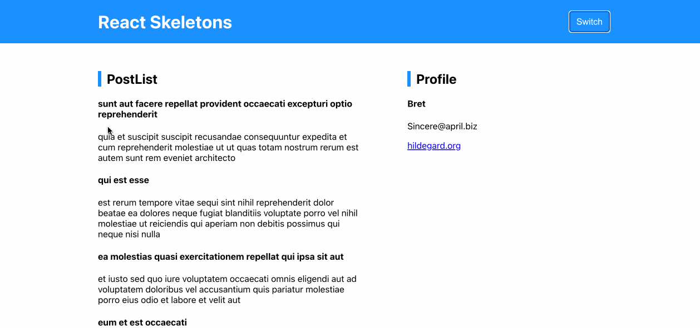

# React-Skelecton

用 React 來實作「Skelecton（輪廓」」的效果，常出現在 Facebook、Youtube 等社群應用軟體，目的是提升使用者體驗。

網站連結：https://jubeatt.github.io/react-skelecton/

## 使用技術

- React
- CSS Layout
- CSS Animation
- JSONPlaceholder (API)
- Dark/Light Theme
- Custom hook



## 運行方式

1. 把專案 clone 下來後安裝依賴項目：

```bash
npm install
```

2. 啟動開發環境：

```bash
npm run start
```

## 打包

```bash
npm run build
```

之後再透過 live-sever 的方式打開 `/build/index.html` 即可
